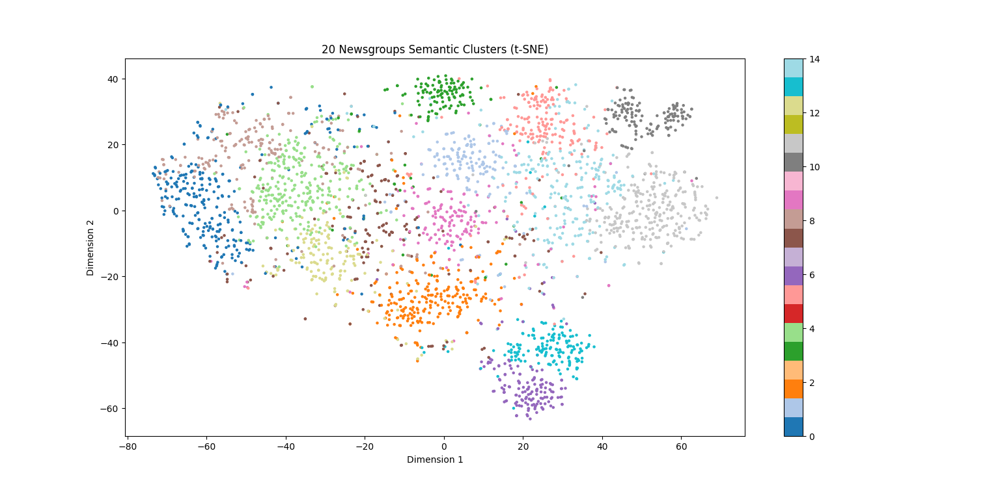

# Semantic Search with Fuzzy Clustering and Semantic Cache

## Abstract

This project presents a production-ready semantic search system that transcends traditional keyword-based retrieval. By leveraging transformer-based embeddings, vector similarity search, and intelligent caching mechanisms, the system enables efficient semantic document retrieval on the 20 Newsgroups dataset. The architecture combines fuzzy clustering for topic discovery and a custom semantic cache that recognizes query equivalence beyond string matching, demonstrating practical applications of modern NLP techniques in information retrieval.

## Overview

A lightweight semantic search system built on the 20 Newsgroups dataset. This project integrates:

- Transformer-based sentence embeddings for semantic text representation
- FAISS vector database for sub-linear similarity retrieval
- Fuzzy clustering to model overlapping document topics with soft assignments
- Custom semantic caching layer that recognizes query equivalence
- FastAPI REST service for production querying
- Docker containerization for reproducible deployment

---

## Table of Contents

1. [System Architecture](#system-architecture)
2. [Key Features](#key-features)
3. [Dataset](#dataset)
4. [Technical Implementation](#technical-implementation)
5. [API Reference](#api-reference)
6. [Evaluation Metrics](#evaluation-metrics)
7. [Installation and Usage](#installation-and-usage)
8. [Project Structure](#project-structure)
9. [Technologies](#technologies)
10. [Key Contributions](#key-contributions)

---

## System Architecture

```
20 Newsgroups Dataset
        ↓
SentenceTransformer Embeddings
        ↓
FAISS Vector Database
        ↓
Fuzzy Clustering
        ↓
Semantic Cache
        ↓
FastAPI API
        ↓
Docker Container
```

---

## Key Features

- **Semantic Retrieval**: Document retrieval based on semantic meaning rather than keyword overlap, capturing intent and context
- **Soft Clustering**: Fuzzy clustering enables documents to simultaneously belong to multiple topics with probability distributions
- **Intelligent Caching**: Recognizes semantically equivalent queries and reuses cached results, reducing inference latency
- **REST API**: Production-ready FastAPI service with comprehensive documentation and real-time query support
- **Reproducible Deployment**: Containerized with Docker for consistent environments across systems
- **Performance Metrics**: Comprehensive evaluation across clustering quality, retrieval effectiveness, and cache efficiency

---

## Dataset

The project uses the **20 Newsgroups** dataset, a standard benchmark in information retrieval and text clustering literature.

### Dataset Characteristics

- Approximately 20,000 documents across 20 distinct newsgroup categories
- Source: https://archive.ics.uci.edu/dataset/113/twenty+newsgroups
- Representative topic coverage including science, computing, recreation, and politics

### Preprocessing

The dataset undergoes standard NLP preprocessing:

- Removal of email headers and metadata
- Removal of quoted reply sections
- Removal of footer information
- Tokenization and lowercasing performed by embedding model

This preprocessing enhances document quality and reduces noise during embedding.

---

## Technical Implementation

<a id="embeddings-and-vector-database"></a>

## Embeddings and Vector Database

### Embedding Generation

Documents are converted to dense vector representations using a pre-trained transformer model:

- **Model**: `sentence-transformers/all-MiniLM-L6-v2`
- **Architecture**: Layered transformer with mean pooling
- **Embedding Dimension**: 384 (balance between expressiveness and computational efficiency)
- **Training Data**: Diverse NLP tasks providing generalized semantic understanding

The embedding model captures semantic relationships between documents, enabling similarity-based retrieval.

### Vector Indexing with FAISS

Embeddings are indexed using Facebook AI Similarity Search (FAISS):

- **Index Type**: Flat index with L2 distance metric
- **Query Complexity**: O(n) per query (suitable for datasets up to ~1M documents)
- **Persistence**: Embeddings and index saved to disk for reproducibility

FAISS enables efficient nearest-neighbor queries, returning top-k most similar documents in milliseconds.

---

<a id="fuzzy-clustering"></a>

## Fuzzy Clustering

Traditional clustering assigns each document to a single cluster. This system uses **fuzzy clustering** to model the inherent multi-topicality of real documents.

### Algorithm

1. **Dimensionality Reduction**: PCA reduces 384-dimensional embeddings to 32 dimensions, reducing computational overhead and noise
2. **Hard Clustering**: KMeans clustering with optimal number of clusters identifies primary topic groups
3. **Soft Assignment**: Compute fuzzy membership matrix where each document has a membership degree (0 to 1) for each cluster

### Interpretation

For example, a single document might have memberships:

```
Cluster 3 (Science) → 0.42
Cluster 7 (Computing) → 0.33
Cluster 9 (Space) → 0.15
Remaining clusters → < 0.10
```

This soft assignment captures documents discussing multiple topics simultaneously.

### Application

Fuzzy clustering serves two purposes:

1. **Topic Discovery**: Understand dominant themes in the document collection
2. **Cache Optimization**: Cluster-aware cache lookup improves matching efficiency

### Cluster Visualization

The following t-SNE visualization shows the spatial distribution of documents in the semantic embedding space, colored by their dominant cluster assignments:



The visualization demonstrates:

- Clear separation between major topic clusters
- Some overlap between adjacent clusters (reflecting document multi-topicality)
- 15 distinct topic groups identified across the 20 Newsgroups dataset
- Dense clustering indicating semantic coherence within groups

---

<a id="semantic-cache"></a>

## Semantic Cache

A traditional cache only matches exact query strings. This project implements a **semantic cache** that caches results based on query similarity.

How it works:

1. Store query embeddings in the cache
2. On a new query, compute its embedding
3. Find cached queries with cosine similarity above a threshold
4. If a close match is found, return cached results instead of re-running retrieval

The cache uses:

- A **global similarity threshold**
- A **cluster-based similarity threshold** (leveraging fuzzy clustering for efficiency)

Example:

- **Query 1**: "machine learning algorithms"
- **Query 2**: "deep learning techniques"

These express identical intent and retrieve semantically equivalent results.

---

## FastAPI Service

The system exposes a production-ready REST API with comprehensive querying and monitoring capabilities.

### API Endpoints

<a id="api-reference"></a>

#### POST `/query`

Executes a semantic search query and returns the most similar document.

**Request**:

```json
{
  "query": "machine learning applications"
}
```

**Response**:

```json
{
  "query": "machine learning applications",
  "cache_hit": false,
  "matched_query": null,
  "similarity_score": null,
  "result": "Retrieved document text...",
  "dominant_cluster": 5
}
```

**Fields**:

- `cache_hit` (boolean): Whether result came from semantic cache
- `matched_query` (string or null): The cached query this matched (if cache hit)
- `similarity_score` (float or null): Cosine similarity to matched query (if cache hit)
- `result` (string): Retrieved document or cached result
- `dominant_cluster` (integer): Most relevant cluster for this query

#### GET `/cache/stats`

Retrieves current semantic cache statistics and performance metrics.

**Response**:

```json
{
  "total_entries": 16,
  "hit_count": 6,
  "miss_count": 10,
  "hit_rate": 0.375
}
```

**Fields**:

- `total_entries`: Number of cached query results
- `hit_count`: Number of times cache was successfully matched
- `miss_count`: Number of cache lookups that failed
- `hit_rate`: Cache effectiveness ratio (hits / total_entries)

#### DELETE `/cache`

Clears the semantic cache and resets all statistics.

**Response**:

```json
{
  "message": "Cache cleared successfully",
  "cleared_entries": 16
}
```

**Use Cases**:

- Reset cache between evaluation runs
- Release memory from large caches
- Clear stale results before redeploying model updates

---

## Evaluation Metrics

The system is evaluated across three complementary dimensions: clustering quality, retrieval effectiveness, and caching efficiency.

### Clustering Metrics

Measures the quality of fuzzy cluster assignments on the embedded document space.

**Silhouette Score** (Range: -1 to 1)

- Higher values indicate tighter, better-separated clusters
- Values near 0 suggest overlapping clusters (expected with fuzzy clustering)
- Computed on PCA-reduced embeddings (32 dimensions)

**Davies-Bouldin Index** (Lower is better)

- Average similarity between each cluster and its most similar neighbor
- Measures cluster separability and compactness
- Smaller values indicate more distinct cluster structure

**Calinski-Harabasz Score** (Higher is better)

- Ratio of between-cluster to within-cluster variance
- Measures how well-defined the clusters are
- Useful for comparing different numbers of clusters

### Retrieval Metrics

Evaluates the quality of document retrieval using newsgroup topic labels.

**Recall@k** (Range: 0 to 1)

- Probability that a document sharing the query's newsgroup appears in top-k results
- Measures coverage of relevant documents
- Computed for k=5 and k=10

For example:

- Recall@5 = 0.208: 20.8% of queries have a topically relevant document in top 5
- Recall@10 = 0.388: 38.8% of queries have a topically relevant document in top 10

### Cache Performance

Measures effectiveness of the semantic cache layer.

**Cache Hit Rate** (Range: 0 to 1)

- Ratio of successful cache matches to total queries
- Higher values indicate effective caching of query patterns
- Depends on query diversity in evaluation set

Example:

```
Total Queries: 16
Cache Hits: 6
Cache Misses: 10
Hit Rate: 0.375 (37.5%)
```

### Typical Results

From a standard evaluation run on 20 Newsgroups:

| Metric                  | Value |
| ----------------------- | ----- |
| Silhouette Score        | 0.077 |
| Davies-Bouldin Index    | 2.94  |
| Calinski-Harabasz Score | 516   |
| Recall@5                | 0.208 |
| Recall@10               | 0.388 |
| Cache Hit Rate          | 0.375 |

---

## Installation and Usage

<a id="installation-and-usage"></a>

### Prerequisites

- Python 3.8 or higher
- pip package manager
- Docker (for containerized deployment)

### Local Setup

Create and activate a virtual environment:

```bash
python -m venv venv
venv\Scripts\activate  # Windows
# or
source venv/bin/activate  # Linux/macOS
```

Install dependencies:

```bash
pip install -r requirements.txt
```

Build the FAISS index and train clustering model (if not already present):

```bash
python build_index.py
```

Run the FastAPI server:

```bash
uvicorn api.main:app --reload
```

The API will be available at `http://localhost:8000` with interactive documentation at `http://localhost:8000/docs`.

### Docker Deployment

Build the Docker image:

```bash
docker build -t semantic-search .
```

Run the container:

```bash
docker run -p 8000:8000 semantic-search
```

The API will be available at `http://localhost:8000/docs`

### Quick Test

Query the API using curl or the interactive docs:

```bash
curl -X POST "http://localhost:8000/query" \
  -H "Content-Type: application/json" \
  -d {"query": "machine learning"}
```

Check cache statistics:

```bash
curl -X GET "http://localhost:8000/cache/stats"
```

---

<a id="project-structure"></a>

## Project Structure

```
Semantic_Search_Project/
├── api/
│   └── main.py                 # FastAPI application
├── cache/
│   ├── semantic_cache.py        # Cache implementation
│   └── query_engine.py          # Query retrieval logic
├── clustering/
│   ├── cluster_analysis.py      # Clustering utilities
│   └── fuzzy_cluster.py         # Fuzzy clustering implementation
├── clustering_results/          # Saved cluster artifacts
│   ├── cluster_centers.npy
│   ├── dominant_clusters.npy
│   └── membership_matrix.npy
├── embeddings/                  # Precomputed embeddings
│   ├── documents.npy
│   ├── embeddings.npy
│   └── metadata.json
├── evaluation/
│   └── eval.ipynb              # Evaluation notebook
├── utils/
│   └── preprocess.py           # Text preprocessing
├── build_index.py              # Build FAISS index
├── test_query.py               # Query testing script
├── Dockerfile                  # Container configuration
├── docker-compose.yml          # Multi-container setup
├── requirements.txt            # Dependencies
└── README.md                   # This file
```

---

<a id="technologies"></a>

## Technologies

### Core Libraries

- **Python 3.8+**: Primary implementation language
- **FastAPI**: Modern web framework for REST API with automatic OpenAPI documentation
- **Sentence Transformers**: Pre-trained transformer models for semantic embeddings
- **FAISS**: Facebook AI Similarity Search for efficient vector retrieval
- **Scikit-learn**: Machine learning utilities (clustering, preprocessing)
- **NumPy**: Numerical computing and array operations

### Infrastructure

- **Docker**: Container platform for reproducible deployment
- **Docker Compose**: Multi-container orchestration (optional)

### Development Tools

- **Jupyter Notebook**: Interactive analysis and evaluation

---

## Key Contributions

This repository demonstrates integrated application of modern NLP and ML techniques:

**Semantic Architecture**:

- Semantic-based retrieval transcending keyword matching to capture intent
- Transformer embeddings (SentenceTransformers) for context-aware representation
- FAISS vector database for efficient similarity search

**Fuzzy Clustering**:

- Soft cluster assignments reflecting document multi-topicality
- Probability distributions over clusters recognizing topic overlap
- Cluster-aware query processing improving cache efficiency

**Intelligent Caching**:

- Custom semantic cache recognizing query equivalence beyond strings
- Two-phase lookup: cluster filtering followed by similarity matching
- Transparent reporting of cache hits to clients

**Production Maturity**:

- REST API with comprehensive documentation and Swagger UI
- Docker containerization enabling reproducible deployment
- Real-time querying with reliable latency characteristics

**Comprehensive Evaluation**:

- Multi-dimensional metrics: clustering, retrieval, and cache performance
- Reproducible benchmarks on standard dataset (20 Newsgroups)
- Clear performance analysis and reporting

---

## References

- [Sentence Transformers - Semantic Text Embeddings](https://www.sbert.net/)
- [FAISS - Efficient Similarity Search](https://github.com/facebookresearch/faiss)
- [20 Newsgroups - UCI Dataset](https://archive.ics.uci.edu/dataset/113/twenty+newsgroups)
- [FastAPI Framework](https://fastapi.tiangolo.com/)

---
